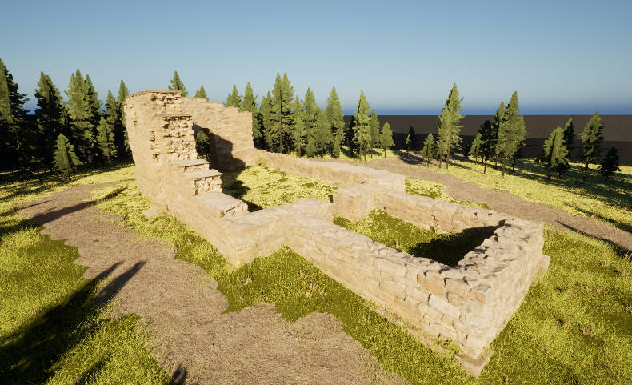
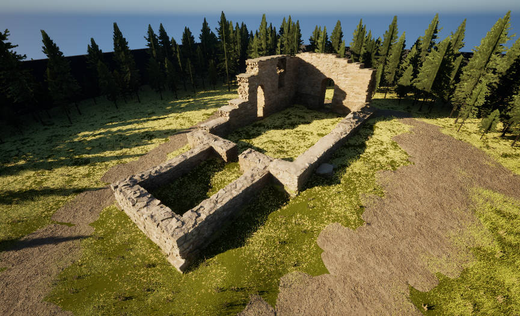

<p align="center">
<h1 align="center">LongRecon Benchmark: A Large-Scale Benchmark for Continuous Long-Sequence 3D Reconstruction</h1>
</p>
<strong><h4 align="center"><a href="https://huggingface.co/datasets/DengKaiCQ/LongRecon" target="_blank">Huggingface (Uploading)</a></h4></strong>
</strong>

It is a dense 3D recon benchmark rendered by Unear Engine, will contains large scale scenarios for 10k images each. But it is currently under construction. 

I am working on it! :)

Utilities for inspecting Unreal Engine EXR depth maps and fusing multi-camera RGB, depth and camera poses into a point cloud.

## Installation

```bash
conda create -n longrecon python=3.11 -y
conda activate longrecon
python -m pip install -r requirements.txt
```

## Data layout

```text
<Scenario Name>/
|-- RGB/
|   `-- Front/          # image_000000.png, ...
|-- Depth/
|   `-- Front/          # depth_000000.exr, ...
`-- Pose/
    `-- Front/
        |-- K/          # 000000.txt, ...
        |-- T_wc/       # 000000.txt, ...
        `-- T_cw/       # 000000.txt, ...
```

## Usage

Inspect one EXR file:

```bash
python utils/readexr.py "path/to/depth_000000.exr"
```

Fuse the selected cameras:

```bash
python -u utils/fuse_pcd.py
```

The streaming pipeline writes temporary PLY chunks and merges them into the path configured by `OUTPUT_PLY`.

Export C2W camera poses as red wireframe frustums:

```bash
python utils/export_camera_frustums.py
```
## Example scenario

You can try by using the example scenario ([link](https://huggingface.co/datasets/DengKaiCQ/LongRecon/tree/main/LongRecon-Example-Ruins)) to quickly get started and familiarize yourself with the benchmark's data format. It is a short sequence of 2500 frames in a small scene. The example scenario is about 7.5 GB (4.04 GB for RGB and 3.50 GB for Depth).

View the `.ply` file using [Meshlab](https://www.meshlab.net/) as below (pointcloud form front 3 views)


And the actual rendered example scene would be like



