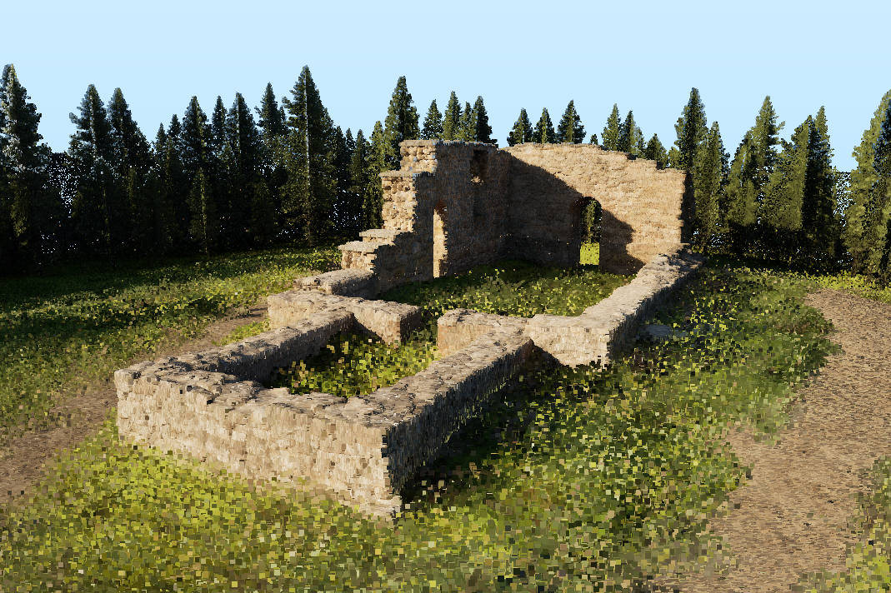
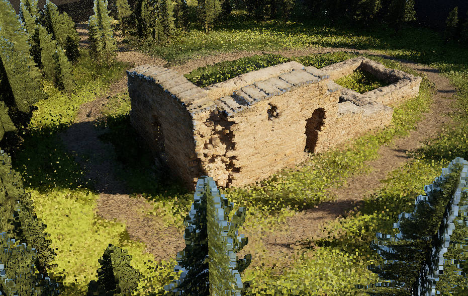
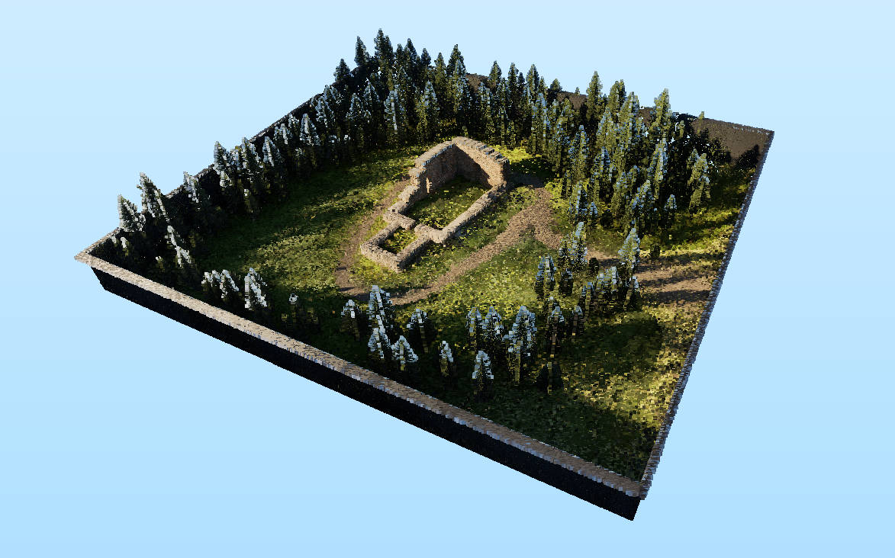
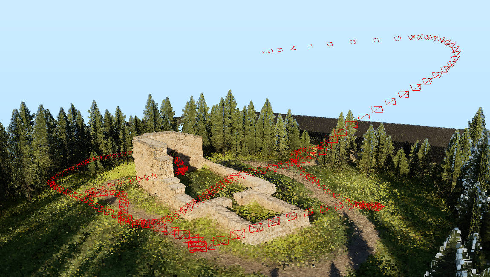
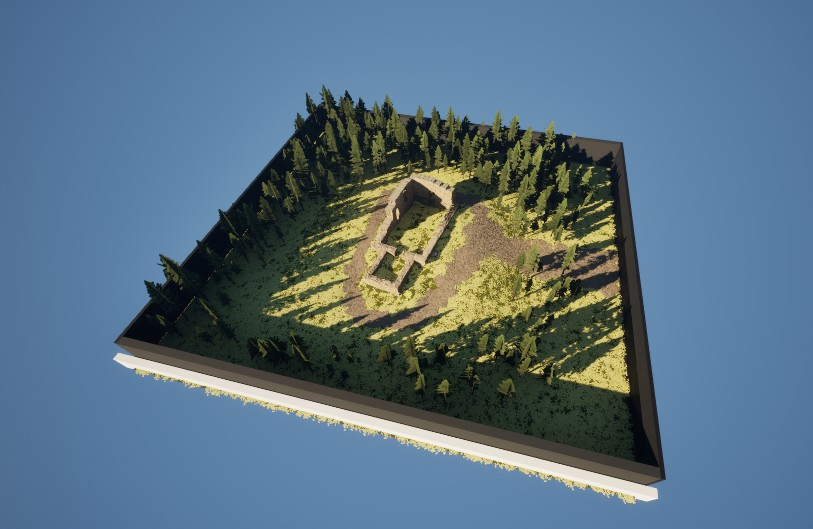

# LongRecon Benchmark: A Large-Scale Benchmark for Continuous Long-Sequence 3D Reconstruction

Utilities for inspecting Unreal Engine EXR depth maps and fusing multi-camera RGB, depth and camera poses into a point cloud.

## Installation

```bash
conda create -n longrecon python=3.11 -y
conda activate longrecon
python -m pip install -r requirements.txt
```

## Data layout

```text
<Senario Name>/
|-- RGB/
|   |-- Front/          # image_000000.png, ...
|   |-- FrontRight/
|   |-- RearRight/
|   |-- Rear/
|   |-- RearLeft/
|   `-- FrontLeft/
|-- Depth/
|   |-- Front/          # depth_000000.exr, ...
|   |-- FrontRight/
|   |-- RearRight/
|   |-- Rear/
|   |-- RearLeft/
|   `-- FrontLeft/
`-- Pose/
|   |-- Front/
|   |    |-- K/          # 000000.txt, ...
|   |    |-- T_cw/       # 000000.txt, ...
|   |    `-- T_wc/       # 000000.txt, ...
|   |-- FrontRight/
|   |-- RearRight/
|   |-- Rear/
|   |-- RearLeft/
|   `-- FrontLeft/
.
```

Set `DATA_DIR` in `utils/fuse_pcd.py`. Select the views to fuse with:

```python
SELECTED_CAMERAS = ["Front", "FrontLeft", "FrontRight"]
```

Use all six names to fuse the complete surround view. `SAMPLE_RATIO` is applied to every frame of every selected camera.

## Usage

Inspect one EXR file:

```bash
python utils/readexr.py "path/to/depth_000000.exr"
```

Fuse the selected cameras:

```bash
python -u utils/fuse_pcd.py
```

The streaming pipeline writes temporary PLY chunks and merges them into the path configured by `OUTPUT_PLY`.

Export C2W camera poses as red wireframe frustums:

```bash
python utils/export_camera_frustums.py
```
You may view the `.ply` file using Meshlab as below (pointcloud form front 3 views)






And the actual rendered example scene would be like

